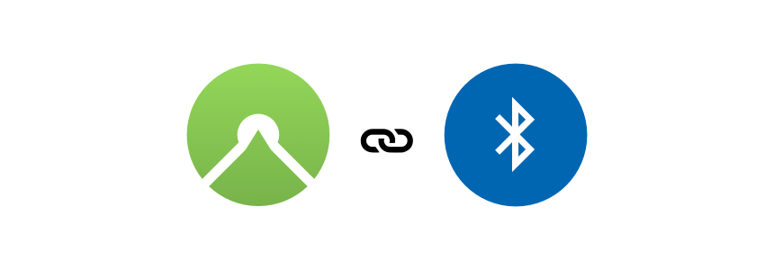
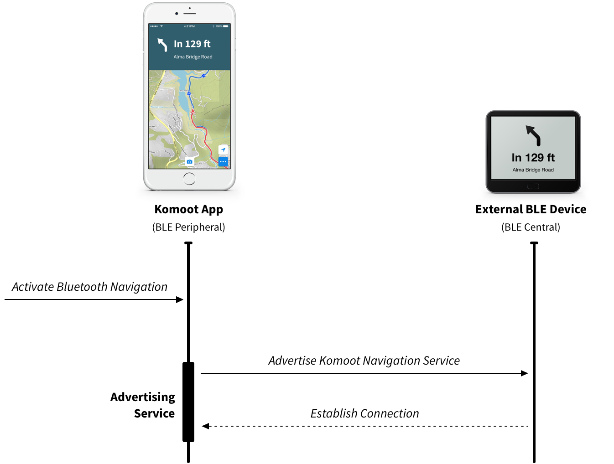
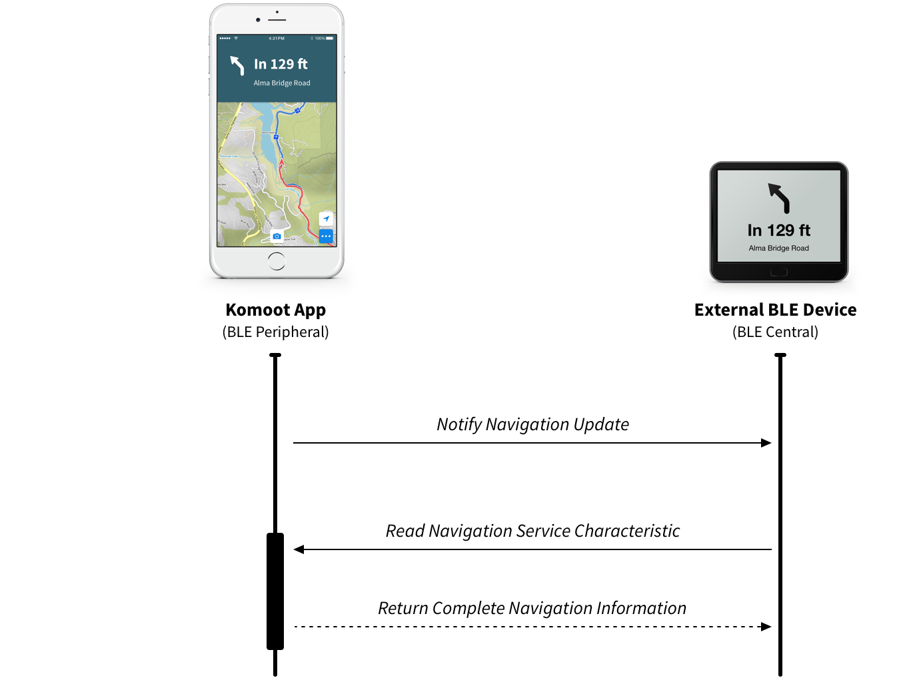

##BLEConnect

With komoot BLE Connect, you can enable your BLE device to show navigation instructions for cycling, running and outdoor routes. [https://www.komoot.de/partner/connect](https://www.komoot.de/partner/connect)

All you need to implement this is found here:

- [How it works](#headerHowItWorks)
- [The Simulator Apps](#headerSimulatorApps)
- [BLE Service Specification](#headerBLESpecification)
- [Transferred data](#headerData)  

##How it works

###Connect to komoot App

####Komoot App
The user activates BLE Connect inside the komoot app settings. When doing so, the app starts advertising the komoot navigation BLE service and tells the user to start pairing via their external BLE device. 
The komoot app stops advertising once the connection to the characteristic is established.

####Your device / what you implement
The external BLE device is responsible to establish the connection and subscribing to the komoot navigation service characteristic. Your device should search for the komoot navigation service (UUID defined below). Otherwise it might be possible that you won’t find the komoot app while the app is in background (not visible).

**Please note**: The advertisement data is different while the app is running in background. For details please check [Apple developer documentation](https://developer.apple.com/library/ios/documentation/NetworkingInternetWeb/Conceptual/CoreBluetooth_concepts/CoreBluetoothBackgroundProcessingForIOSApps/PerformingTasksWhileYourAppIsInTheBackground.html#//apple_ref/doc/uid/TP40013257-CH7-SW1).

###Receive Navigation Instructions

####Komoot App
The komoot app sends instructions data ~1 per second when a navigation gets started (or resumed) in the komoot app. How data is transferred is described in detail [below](#headerData).

####Your device / what you implement
The komoot app announces new data by using notifications. Once you receive a notification, you need to start a read request to get the full data object of the last navigation instruction. 

###Reconnect and connection status

####Komoot App
The komoot app repeats the last navigation instruction every 2 seconds (might be changed in the future). It observes your read requests, and if there hasn’t been a read request for a longer time (5 sec. Might be changed in the future), the app assumes that the connection got lost and will start advertising the service again. Your device configured as a BLE central should then initiate a reconnect.

####Your device / what you implement
You have to start the scanning for the navigation service once you detect the connection to the peripheral got lost. After a few seconds, the komoot app will start the advertising.

##The Simulator Apps

To make development easier for you, we created two simulator apps you can find in this repository. Just clone the repository and open the Xcode Project to start the simulators on your iOS device.

| KomootAppSimulator | BLEDeviceSimulator |
|:---:|:---:|
|  |  |
| Simulates the behavior of the komoot app. (BLE Peripheral) | Simulates a BLE device that receives the BLE Navigation Service. (BLE Central) |

##BLE Service Specification

| UUID | Description  | Access  |
|---|---|---|
|71C1E128-D92F-4FA8-A2B2-0F171DB3436C|GATT Primary Service Declaration|Readonly|
|503DD605-9BCB-4F6E-B235-270A57483026|GATT Characteristic to subscribe for navigation updates|Notify, Readonly|

##Transferred Data
When you read the GATT characteristic after you got notified, you will receive the following data.

- [Identifier](#data_identifier) (UUID)
- [Direction Arrow](#data_directionArrows) (UInt8)
- [Distance](#data_distance) (UInt32)
- [Street](#data_street) (UTF8-String)

###Identifier

UUID to identify a single navigation instruction. Use this identifier for sending the read request to the characteristic. If we get a read request without this identifier, we will deliver the last data object.

### Direction Arrows

The direction will be represented as an UInt8 value. The following list shows the mapping between the image and the corresponding UInt8 value. This list could be extended in future.

You can download the arrows [here](assets/nav-icons/navigationArrows.zip) or make your own design.

| Direction | Number value  | Description |
|:---:|---|---|
|No image|0|Reserved|
||1|Go Straight|
||2|Start|
||3|Finish|
||4|Slight left|
||5|Left|
||6|sharp left|
||7|sharp right|
||8|right|
||9|Slight right|
||10|Fork right|
||11|Fork left|
||12|U-Turn|
|No image|13|Reserved|
|No image|14|Reserved|
||15|Roundabout exit left|
||16|Roundabout exit right|
||17|Roundabout counter clockwise exit 1 of 1|
||18|Roundabout counter clockwise exit 1 of 2|
||19|Roundabout counter clockwise exit 1 of 3|
||20|Roundabout counter clockwise exit 2 of 2|
||21|Roundabout counter clockwise exit 2 of 3|
||22|Roundabout counter clockwise exit 3 of 3|
||23|Roundabout clockwise exit 1 of 1|
||24|Roundabout clockwise exit 1 of 2|
||25|Roundabout clockwise exit 1 of 3|
||26|Roundabout clockwise exit 2 of 2|
||27|Roundabout counter clockwise exit 2 of 3|
||28|Roundabout counter clockwise exit 3 of 3|
||29|Roundabout fallback|
||30|Out of route|
|No image|31…n|We might enhance the table in future versions.|

###Distance

The distance is provided in meters. There is no rounding done by the komoot app. Your implementation is responsible to round and convert into the right measurement system. 

This is an example how we do rounding in the komoot app:

| Distance Range | Rounding step | Example |
|---|---|---|
|0 - 5|0|Now|
|6 - *|10|14 -> 10|

###Street

The street is provided as UTF-8 string. The street is starting at byte 21 until the end of the data object.
